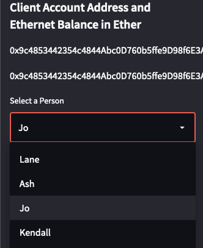
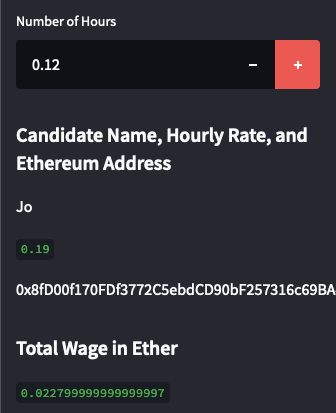

## Unit 19 Homework: Cryptocurrency Wallet

## Background

A start-up is building a new and disruptive platform called Fintech Finder. Fintech Finder is an application that its customers can use to find fintech professionals from among a list of candidates, hire them, and pay them. Fintech Finder’s lead developer, was tasked with integrating the Ethereum blockchain network into the application in order to enable customers to instantly pay the fintech professionals whom they hire with cryptocurrency.

Customers will be able to send cryptocurrency payments to fintech professionals. To develop the code and test it out, the assumed persona is that of the perspective of a Fintech Finder customer who is using the application to find a fintech professional and pay them for their work.

## Solution

[Click to interact with this Streamlit - Cryptocurrency Wallet app.](https://unit-19-cryptocurrency-wallet.herokuapp.com)

The Streamlit app was deployed locally.

This image illustrates selected a different candidated than the default.  

Payment transfer input and recording - with snow animation instead of ballons in from the boilerplate file.  
  

---
